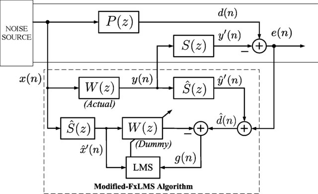
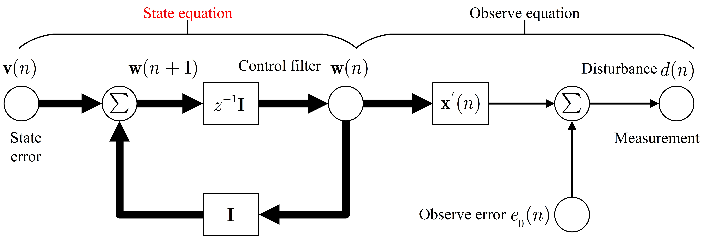
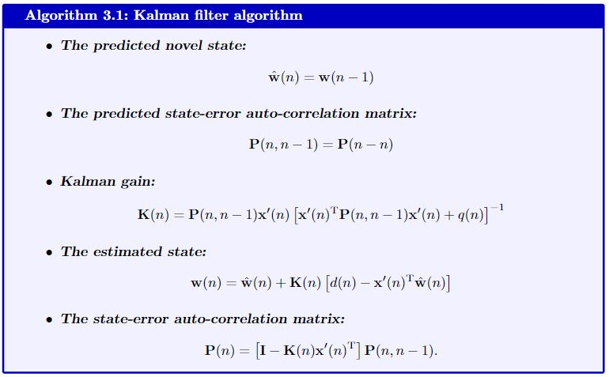
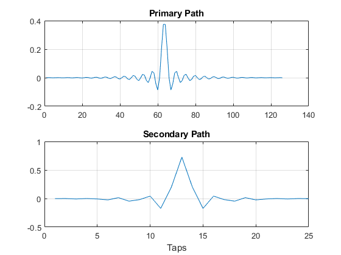
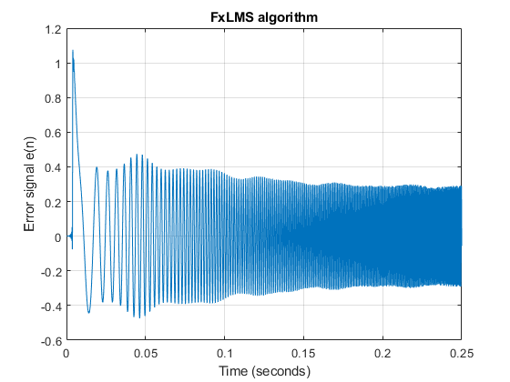
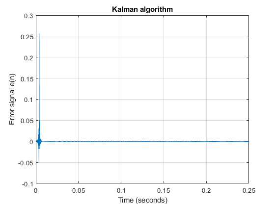
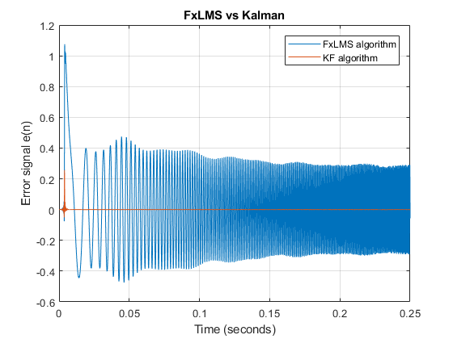

# Kalman Filter Approach for Active Noise Control

## Introduction

This article offers an elaborate description of the Kalman filter code employed in the active control system. Conventional active noise management methods usually employ an adaptive filter, such as the filtered reference least mean square (FxLMS) algorithm, to adjust to changes in the primary noise and acoustic environment. Nevertheless, the slow convergence characteristics of the FxLMS algorithm typically impact the effectiveness of reducing dynamic noise. Hence, this study suggests employing the Kalman filter in the active noise control (ANC) system to enhance the efficacy of noise reduction for dynamic noise. The ANC application effectively utilizes the Kalman filter with a novel dynamic ANC model.  The numerical simulation revealed that the proposed Kalman filter exhibits superior convergence performance compared to the FxLMS algorithm for handling dynamic noise.

## Basic Theoretical Principle

One renowned approach for adaptive active noise reduction is the modified FxLMS algorithm, depicted in Figure 1. The internal model technique utilizes the secondary path estimate to recover the disturbance from the error signal, enabling the use of the traditional least mean square (LMS) algorithm for noise control. This altered configuration can also be employed to implement the Kalman filter methodology, wherein the LMS model is substituted with the Kalman filter to complete the updating of the control filter.

  
Figure 1: Block diagram of the modified ANC structure based on the FxLMS algorithm.  

In order to employ the Kalman filter methodology, the initial step entails establishing the state function. The subsequent paragraphs will elucidate the state function definition of the ANC system. As we know, when the adaptive algorithm converges, the ANC system should achieve the optimal control filter, which is a constant solution:

$$\begin{equation}\mathbf{w}(n+1)=\mathbf{w}(n)=\mathbf{w}\_{\text{o}},\end{equation}$$

 where $\mathbf{w}\_{\text{o}}$ denotes the optimal control filter. Meanwhile, the attenuated noise can be expressed as

 $$\begin{equation}e\_\mathrm{o}(n)=d(n)-\sum^{L-1}\_{i=0}\hat{s}\_l\cdot\mathbf{x}^\mathrm{T}(n-i)\mathbf{w}\_\mathrm{o}(n-i),\end{equation}$$

 where $d(n)$ and $\mathbf{x}^\prime(n)$ represent the disturbance signal and the reference vector, respectively, and $\hat{s}\_i$ stands for the $i$-th coefficient of the secondary path estimate. Since the optimal control filter is a constant vector, (2) can be rewritten to

 $$\begin{equation}d(n)=\mathbf{x}^\prime(n)^\mathrm{T}\mathbf{w}\_\mathrm{o}(n)+e\_\mathrm{o}(n),\end{equation}$$

 and the filtered reference signal is given by 

 $$\begin{equation}\mathbf{x}^\prime(n)=\sum^{L-1}\_{i=0}\hat{s}\_i\mathbf{x}(n-i).\end{equation}$$

 It is natural to let (1) and (3) be the state equation and the observation equation, respectively, as shown in Figure 2. The Kalman filter recursive equations are listed out as 

 
 Figure 2: Signal-flow graph representation of a linear, discrete-time dynamic ANC model.
 
 - The prediction for the new state: 

 $$\begin{equation}\hat{\mathbf{w}}(n)=\mathbf{w}(n-1)\in\mathbb{R}^{N\times 1},\end{equation}$$

 where $N$ denotes the length of the control filter.
 
 - The prediction of the auto-correlation matrix of the state error:

 $$\begin{equation}\mathbf{P}(n,n-1)=\mathbf{P}(n-n)\in\mathbb{R}^{N\times N}.\end{equation}$$

 Here, we assumed that the variance of the final state error equals $0$.

- The Kalman gain matrix is obtained from 

$$\begin{equation}\mathbf{K}(n)=\mathbf{P}(n,n-1)\mathbf{x}^\prime(n)\left[\mathbf{x}^\prime(n)^\mathrm{T}\mathbf{P}(n,n-1)\mathbf{x}^\prime(n)+q(n)\right]^{-1},\end{equation}$$

where $q(n)$ denotes the variance of the observe error:

$$\begin{equation}q(n)=\mathbb{E}[e^2\_\mathrm{o}(n)].\end{equation}$$

- The estimate of the state is given by 

$$\begin{equation}\mathbf{w}(n)=\hat{\mathbf{w}}(n)+\mathbf{K}(n)\left[d(n)-\mathbf{x}^\prime(n)^\mathrm{T}\hat{\mathbf{w}}(n)\right].\end{equation}$$

- The auto-correlation matrix of the state error:

$$\begin{equation}\mathbf{P}(n)=\left[\mathbf{I}-\mathbf{K}(n)\mathbf{x}^\prime(n)^\mathrm{T}\right]\mathbf{P}(n,n-1).\end{equation}$$

It should be emphasized that the algorithm assumes a variance of $0$ for the state error, while still accounting for the observed error. This implies that the control filter's transition has a greater level of confidence compared to the observation function. Certainly, the user can also modify the two variations while controlling the process, based on the particular application.

By summarizing the above equations, the Kalman filter for the active noise control is given by:


# Code Explanation

The section provides a concise introduction to the `KF.mat` file, which implements the Kalman filter method for a single-channel active noise control (ANC) application. Furthermore, the FxLMS algorithm is conducted as a comparative analysis. The Kalman filter technique employs the modified feed-forward active noise control (ANC) structure, whereas the FxLMS algorithm uses the conventional feed-forward ANC structure.    

## Contents

- [Cleaning the memory and workspace](#cleaning-the-memory-and-workspace)
- [Loading the primary and secondary path](#loading-the-primary-and-secondary-path)
- [Simulation system configuration](#simulation-system-configuration)
- [Creating the disturbance and filtered reference](#creating-the-disturbance-and-filtered-reference)
- [Dynamic noise cancellation by the single channel FxLMS algorithm](#dynamic-noise-cancellation-by-the-single-channel-fxlms-algorithm)
- [Dynamic noise cancellation by the Kalman filter approach](#dynamic-noise-cancellation-by-the-kalman-filter-approach)

## Cleaning the memory and workspace

This segment of code is utilized to clean the memory and workspace of the MATLAB software. 

```matlab
close all ;
clear     ;
clc       ;
```

## Loading the primary and secondary path

This part of the code loads the primary path and secondary path from the Mat files: `PriPath_3200.mat` and `SecPath_200_6000.mat`. All these paths are synthesized from the band-pass filters, whose impulse responses are illustrated in Figure 3.

```matlab
load('PriPath_3200.mat');
load('SecPath_200_6000.mat') ;
figure ;
subplot(2,1,1)
plot(PriPath);
title('Primary Path');
grid on      ;
subplot(2,1,2);
plot(SecPath);
title('Secondary Path');
xlabel('Taps');
grid on      ;
```

  
Figure 3: The impulse response of the primary path and the secondary path.

## Simulation system configuration

The sampling rate of the active noise control (ANC) system is set to $16000$ Hz, and the simulation duration is $0.25$ second. To simulate the dynamic noise, the primary noise in this ANC system is a chirp signal, whose frequency gradually varies from $20$ Hz to $1600$ Hz, as shown in Figure 4.

| Parameter | Definition        | Parameter | Definition           |
|-----------|--------------------|-----------|----------------------|
| fs        | Sampling rate      | T         | Simulation duration  |
| y         | Primary noise     | N         | Simulation taps      |


```matlab
fs = 16000     ; % sampling rate 16 kHz.
T  = 0.25      ; % Simulation duration (seconds).
t  = 0:1/fs:T  ;% Time variable.
N  = length(t) ;
fw = 500       ;
fe = 300       ;
y = chirp(t,20,T,1600);
figure   ;
plot(t,y);
title('Reference signal x(n)');
xlabel('Time (seconds)') ;
ylabel('Magnitude')      ;
axis([-inf inf -1.05 1.05]);
grid on ;
```

  
Figure 4: The waveform of the reference signal that is a chirp signal ranging from $20$ to $1600$ Hz.

## Creating the disturbance and filtered reference

The disturbance and filtered reference used in the ANC system are created by passing the chirp signal through the loaded primary and secondary paths.

| Parameter | Definition                 | Parameter | Definition             |
|-----------|----------------------------|-----------|------------------------|
| X         | Reference signal vector    | y         | Primary noise          |
| D         | Disturbance vector         | PriPath   | Primary path vector    |
| Rf        | Filtered reference vector  | SecPath   | Secondary path vector  |


```matlab
%X  = 0.4*sin(2*pi*fw*t)+0.3*sin(2*pi*fe*t);
X = y;
%plot(X(end-100:end))
D  = filter(PriPath,1,X);
Rf = filter(SecPath,1,X);
%plot(D(end-100:end))
```

## Dynamic noise cancellation by the single channel FxLMS algorithm

In this part, the single-channel FxLMS algorithm is used to reduce the chirp disturbance. The length of the control filter in the FxLMS algorithm has $80$ taps, and the step size is set to $0.0005$. Figure 5 shows the error signal picked up by the error sensor in the ANC system. This figure shows that the FxLMS algorithm can not fully attenuate this dynamic noise during the $0.25$ second. 

| Parameter | Definition                        | Parameter | Definition                                 |
|-----------|-----------------------------------|-----------|--------------------------------------------|
| X         | Reference signal vector           | y         | Control signal                             |
| D         |  Disturbance vector               | e         | Error signal                              |
| L         | Length of the control filter      | muW       | Step size                                |


```matlab
L   = 80    ;
muW = 0.0005;
noiseController = dsp.FilteredXLMSFilter('Length',L,'StepSize',muW, ...
    'SecondaryPathCoefficients',SecPath);
[y,e] = noiseController(X,D);
figure;
plot(t,e) ;
title('FxLMS algorithm')   ;
ylabel('Error signal e(n)');
xlabel('Time (seconds)')   ;
grid on ;
```

   
Figure 5. The error signal of the single-channel ANC system based on the FxLMS algorithm.

## Dynamic noise cancellation by the Kalman filter approach

The Kalman filter is employed in the signal-channel ANC system to track the fluctuation of the chirp disturbance. The variance of the observed noise is initially set to $0.005$. Figure 6 shows the error signal of the Kalman filter algorithm. Additionally, Figure 7 illustrates the variation of the coefficients $w_5(n)$ and $w_{60}(n)$ as time progresses. The outcome illustrates that the Kalman filter effectively mitigates the chirp disturbances. The Kalman filter approach has markedly superior convergence behavior compared to the FxLMS method, as illustrated in Figure 8. 

| Parameter | Definition                        | Parameter | Definition                                 |
|-----------|-----------------------------------|-----------|--------------------------------------------|
| q         | Variance of observe error         | P         | Cross-correlation matrix of state error   |
| W         | Control filter                    | ek        | Error signal                              |
| Xd        | Input vector                      | yt        | Anti-noise                                |
| Rf        | Reference signal vector           |           |                                            |

```matlab
q  = 0.005;
P  = eye(L);
W  = zeros(L,1);
Xd = zeros(L,1);
ek = zeros(N,1);
w5 = zeros(N,1);
w60 = zeros(N,1);

%-----------Kalman Filer---------
for ii =1:N
    Xd     =[Rf(ii);Xd(1:end-1)];
    yt     = Xd'*W ;
    ek(ii) = D(ii)-yt ;
    K      = P*Xd/(Xd'*P*Xd + q);
    W      = W +K*ek(ii)        ;
    P      =(eye(L)-K*Xd')*P    ;
    %---------------------------
    w5(ii)  = W(5);
    w60(ii) = W(60);
    %---------------------------
end
%-------------------------------
figure;
plot(t,ek);
title('Kalman algorithm')   ;
ylabel('Error signal e(n)');
xlabel('Time (seconds)')
grid on ;
figure
plot(t,w5,t,w60);
title('Control Filter Weights');
xlabel('Time (seconds)');
legend('w_5','w_{60}');
grid on ;
figure;
plot(t,e,t,ek);
title('FxLMS vs Kalman')   ;
ylabel('Error signal e(n)');
xlabel('Time (seconds)')   ;
legend('FxLMS algorithm','KF algorithm');
grid on ;
```

  
Figure 6: The error signal of the single-channel ANC system based on the Kalman filter.  

  
Figure 7: The time history of the coefficients $w\_{5}(n)$ and $w\_{60}(n)$ in the control filter.  

  
Figure 8：Comparison of the error signals in the FxLMS algorithm and the Kalman filter. 

## Summary
This document provides a detailed introduction to the Kalman filter code used in the active control system. Traditional active noise control typically adapts the adaptive filter, such as the filtered reference least mean square (FxLMS) algorithm, to adapt to the variations of the primary noise and acoustic environment. However, the sluggish convergence behavior of the FxLMS algorithm usually affects the noise reduction for the dynamic noise. Therefore, this work proposes using the Kalman filter in the ANC system to improve the noise reduction performance for dynamic noise. With a novel dynamic ANC model, the Kalman filter is excellently deployed in the ANC application.  The numerical simulation demonstrated that the proposed Kalman filter has a much better convergence performance than the FxLMS algorithm in dealing with dynamic noise. 

## Reference 
``` bibtex
@article{shi2020algorithms,
  title={Algorithms and implementations to overcome practical issues in active noise control systems},
  author={Shi, Dongyuan},
  year={2020},
  publisher={Nanyang Technological University}
}
